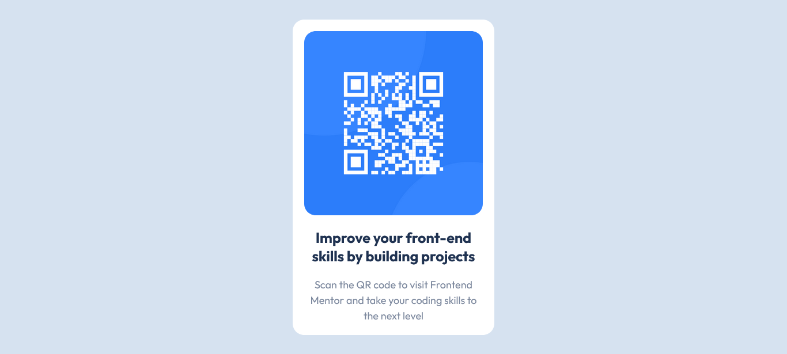

# Frontend Mentor - QR code component solution

This is a solution to the [QR code component challenge on Frontend Mentor](https://www.frontendmentor.io/challenges/qr-code-component-iux_sIO_H). Frontend Mentor challenges help you improve your coding skills by building realistic projects. 

## Table of contents

- [Overview](#overview)
  - [Screenshot](#screenshot)
  - [Links](#links)
- [My process](#my-process)
  - [Built with](#built-with)
  - [Useful resources](#useful-resources)
- [Author](#author)

## Overview

### Screenshot

### Links

- Solution URL: [Github](https://github.com/DevGirlJS/QR-Code-Component)
- Live Site URL: [Github pages](https://devgirljs.github.io/QR-Code-Component/)

## My process

### Built with

- HTML5 markup
- CSS custom properties
- Flexbox

### Useful resources

- [css custom properties](https://developer.mozilla.org/en-US/docs/Web/CSS/Using_CSS_custom_properties)
- [flexbox](https://developer.mozilla.org/en-US/docs/Learn/CSS/CSS_layout/Flexbox) 

## Author
- Frontend Mentor - [DevGirlJS](https://www.frontendmentor.io/profile/DevGirlJs)

